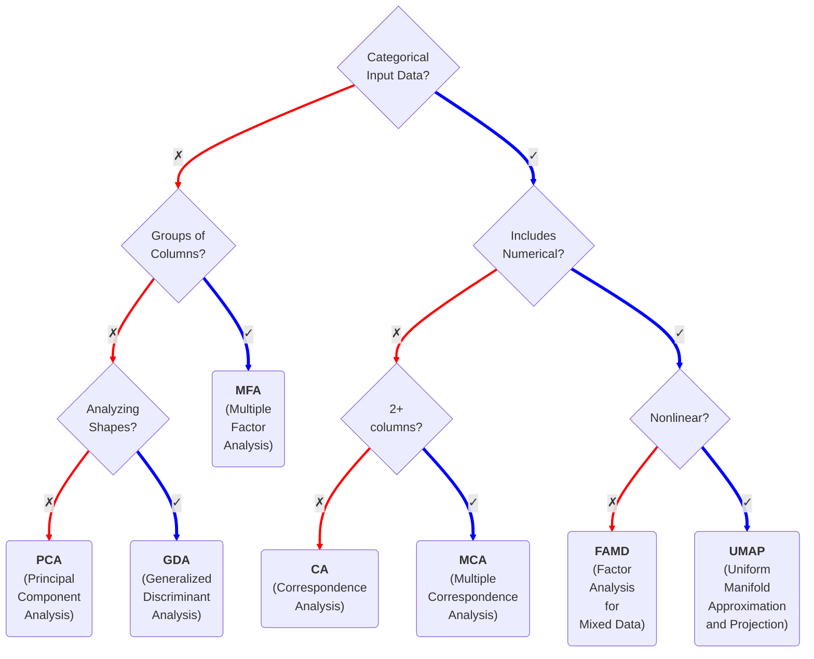

# Dimensionality Reduction

## Decision Tree
how to decide what kind of dimensionality reduction to apply based on your input data

```mermaid
flowchart TD

%% decisions
cd{Categorical </br> Input Data?}
in{Includes </br> Numerical?}
gc{Groups of </br> Columns?}
2c{2+ </br> columns?}
as{Analyzing </br> Shapes?}
no{Nonlinear?}

%% methods
fa("<b>FAMD</b> </br> (Factor </br> Analysis </br> for </br> Mixed Data)")
um("<b>UMAP</b> </br> (Uniform </br> Manifold </br>  Approximation </br> and Projection)")
mc("<b>MCA</b>  </br> (Multiple </br> Correspondence </br> Analysis)")
ca("<b>CA</b>   </br> (Correspondence </br> Analysis)")
mf("<b>MFA</b>  </br> (Multiple </br> Factor </br> Analysis)")
gd("<b>GDA</b>  </br> (Generalized </br> Discriminant </br> Analysis)")
pc("<b>PCA</b>  </br> (Principal </br> Component </br> Analysis)")

cd -- ✗ --> gc
cd -- ✓ --> in
in -- ✗ --> 2c
in -- ✓ --> no
no -- ✗ --> fa
no -- ✓ --> um
2c -- ✗ --> ca
2c -- ✓ --> mc
gc -- ✗ --> as
gc -- ✓ --> mf
as -- ✗ --> pc
as -- ✓ --> gd

linkStyle 0,2,4,6,8,10 stroke:red,stroke-width:3px
linkStyle 1,3,5,7,9,11 stroke:blue,stroke-width:4px
```
