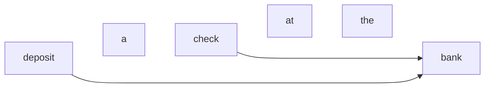

# Natural Language Processing

[Natural Language Processing (NLP)](https://www.geeksforgeeks.org/nlp/natural-language-processing-nlp-tutorial/) understands and interacts with human languages in a way that feels natural. `NLP` uses [ML](./ml.md), but isn't [ML](./ml.md) itself. `NLP` is the application, [ML](./ml.md) is the engine.

- [Kaggle Natural Language Processing Guide](https://www.kaggle.com/learn-guide/natural-language-processing) has links to a lot of relevant tutorials and project ideas. The best place to start is probably their guide on [Getting started with NLP for absolute beginners](https://www.kaggle.com/code/jhoward/getting-started-with-nlp-for-absolute-beginners)

## Maintenance Records Classification Task

- Trying to remember and practice a particular problem
- dataset was perhaps four columns, I sort of remember 3 of them
- need to predict the category from the other data
- first order of business: find a similar dataset or problem
- first place to start is probably the Kaggle Guide [Getting started with NLP for absolute beginners](https://www.kaggle.com/code/jhoward/getting-started-with-nlp-for-absolute-beginners).


| date      | service                                 | category   |
| ----------- | ----------------------------------------- | ------------ |
| 4/13/2004 | patched hull                            | watercraft |
| 6/1/2005  | tire change                             | vehicle    |
| 6/22/2005 | waxed wing, swapped landing gear spring | aircraft   |
| ...       | ...                                     | ...        |

## Hugging Face Transformers Library

- the Kaggle [Getting started with NLP for absolute beginners](https://www.kaggle.com/code/jhoward/getting-started-with-nlp-for-absolute-beginners) notebook required some additional libraries to be installed
- one of them was `transformers` from [Hugging Face](https://huggingface.co/docs/transformers/en/index)
- it's a "model-definition framework"
- sounds like a standardized way of using models so that you could, say, take a model that was trained in `Tensorflow` and load it into `PyTorch`? Or have either of those things reach out to a trained `LLM`?
- I think it might have a different meaning than the `transformers` discussed below

## Large Language Models (LLM's)

The best videos to summarize these are from the 3Blue1Brown [Deep Learning / Neural Networks Course](https://youtube.com/playlist?list=PLZHQObOWTQDNU6R1_67000Dx_ZCJB-3pi&si=0_HYbGimQB-Tx1tF) - 8 videos covering neural networks, backpropagation, LLM's, and Transformers. Each video is 8-30 minutes long, total runtime about 2 hours. The videos on Neural Networks were made way back in 2018, and the LLM videos were made in 2024, so there's a chance more will be added if something else game-changing is discovered. For an overview, just watch the 8 minute video [Large language models explained briefly](https://youtu.be/LPZh9BOjkQs?si=K21ni-7Kl-A28Te0).

- Neural Networks
    - [What is a neural network?](https://youtu.be/aircAruvnKk?si=HxQewJQ3Zz8GRZYL)
    - [Gradient descent, how neural networks learn](https://youtu.be/IHZwWFHWa-w?si=fgadmhmJntK_--Ox)
    - [Backpropagation, intuitively](https://youtu.be/Ilg3gGewQ5U?si=MCDaQJPucfo5qGq2)
    - [Backpropagation, calculus](https://youtu.be/tIeHLnjs5U8?si=akKnuCFaTsUaXm1y)
- LLM's
    - [Large language models explained briefly](https://youtu.be/LPZh9BOjkQs?si=K21ni-7Kl-A28Te0)
    - [Transformers, the tech behind LLM's](https://youtu.be/wjZofJX0v4M?si=e6bkNOMBgaE27dcx)
    - [Attention in transformers](https://youtu.be/eMlx5fFNoYc?si=J5E4BdXGkBsotegN)
    - [How LLM's store facts](https://youtu.be/9-Jl0dxWQs8?si=nyvCnrZJ19H1L7Vu)

### [Large Language Models Explained Briefly](https://youtu.be/LPZh9BOjkQs?si=K21ni-7Kl-A28Te0)
An **LLM** is a sophisticated mathematical function that predicts what word comes next for any given text.
The output is a *probability* for each possible token (tokens are often words, but might contain punctuation, etc).
You choose one of the **likely** tokens from the list, but not always the **most likely** in order to make the response more natural (I believe that the "temperature" setting controls how far the choices diverge from the most likely).

You do this over and over, feeding in the initial prompt as well as all predicted tokens, predicting one more token at a time until you've got a full response.

#### Prompting
Since it's just predicting one of the likely words over and over, you need to set up the initial prompt so that the likely words are the ones that will best answer the question.

So if a user asked what to do on their vacation, you might add the following so that the likely words are also the most helpful (AKA prompt engineering):

```
What follows is a conversation between a user and a helpful, very knowledgeable AI assistant

Use: Give me some ideas for what to do when visiting Santiago.

AI Assistant: ______
```

#### Pretraining
To be able to predict the likely tokens like a human would, the model needs to be trained by feeding it human-written text. 
A **massive** amount of it.
Since you need so much, you normally get it from the internet.

Each training sample can be a handful of words (like a text message) or thousands (like a novel). 
You pass the model all but the last token of a string of text, then compare the prediction it makes with the true last token that you withheld.
After that, you tweak the model to make it more likely that the model will predict the true token and less likely to predict the other tokens.

The model is adjusted by changing the (potentially **billions**) of `parameters`/`weights` through a process known as `backpropagation`. 
The staggering number of these weights is what puts the **L** in **LLMs**.
The graphic he uses for an LLM looks like a standard neural network, with each layer being a 2D matrix.
The scale of operations required to train the larger LLMs is astronomical.

On top of that, this `pretraining` step is only the first part of the process.
What you've got after this step is an AI that's very good at auto-completing random text from the internet. 
That's a far cry from having a helpful AI assistant.

#### Reinforcement Learning with Human Feedback (RLHF)
A huge number of human workers flag problematic/unhelpful predictions, which further tweaks the weights of the model to prefer to predict helpful responses.

#### Transformers
The process is only possible through the use of **Graphical Processing Units (GPUs)**, which can perform operations in parallel, **BUT** prior to 2017, not all language operations could be easily parallelized, and models needed to process one word at a time (i.e. each time you needed to predict a new word, it needed to process each word of the prompt and all predictions so far one word at a time).

Google introduced a new model - the `Transformer` - which doesn't need to read the input text from the start to the finish. They read it all in at once, in parallel. 

Each token in the prompt is associated with a `vector` - a long list of numbers (since neural networks work off of continuous numbers), which encode the **meaning** of the token.

##### Attention

`Transformers` are associated with a special operation known as `Attention`, which gives the `vectors` of each `token` in the prompt a chance to talk with one another and figure out which ones work together. It uses the context of surrounding `tokens` to inform the more specific meaning of other `tokens`, all in parallel.

For instance, the `token` for "`bank`" in this sentence has its `vector` modified by the `vectors` for the `tokens` `deposit` and `check` to encode the meaning of a `financial bank`



While the same `token` "`bank`" in this sentence would have its `vector` modified by "`river`" so that its meaning is encoded as a `river bank`.


I'm guessing the token's vector doesn't get modified in-place, but rather each of these layers outputs a vector for each token which is modified for the operation (otherwise I can't think of how `backpropagation` would work)

##### Feedforward

`Transformers` typically also include a `Feedforward Neural Network` operation, which gives extra capacity to store more information about patterns during training.

###### Repeat

The `transformer` will generally have multiple iterations of these two operations - an `Attention`operation followed by a `Feedforward` operation followed by an `Attention` operation and so on. Each successive pair should further encode the meaning of each `token` to make a more accurate prediction about the last word.

I'm guessing that the `attention` and `feedforward` blocks are also trained during `pretraining` and `RLHF`

##### Final Vector
The final vector in the sequence, once influenced by everything the model learned during training as well as the context encoded by the `attention` and `feedforward` stacks, will do one final operation. it will output a vector with one probability for each possible `token` that could come next.