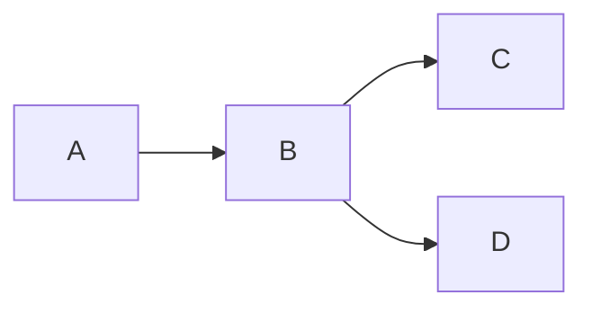

# Markdown
- example of Markdown Files rendered by Sphinx
- put example Myst-Parser compatible stuff here to be able to quickly reference elsewhere.

## Mermaid Diagrams
- Sphinx can build Mermaid diagrams thanks to `sphinxcontrib.mermaid` and `myst-parser` (included with `myst-nb`)
- if `myst_fence_as_directive = ["mermaid"]` is set in `conf.py`, Sphinx will render diagrams created with triple backtick mermaid code blocks (otherwise you'll get the error `Pygments lexer name 'mermaid is not known` while building docs)
- I had to add [custom.css](../_static/custom.css) with `!important` flags to get the arrows to show up against the background in Sphinx Book Theme's Dark Mode, as mermaid themes and regular css styles were being overridden by really high-specificity css (something must be set really late in the process, maybe even live when pressing the Dark Mode button)

## [Admonitions](https://myst-parser.readthedocs.io/en/latest/syntax/admonitions.html)
- these call out blocks of text as important

### Blue Admonitions

:::{note}
probably my most commonly suggested admonition
:::

### Green Admonitions

:::{tip}
here's a tip for ya
:::

:::{hint}
A Clue!
:::

:::{seealso}
this could good for links to other sources 
:::

### Orange Admonitions

:::{attention}
please, just a moment of your time
:::

:::{important}
I'm kind of a big deal around here
:::

:::{caution}
I wouldn't if I were you
:::

:::{warning}
Seriously, I wouldn't
:::

### Red Admonitions

:::{danger}
stop if you know what's good for you
:::

:::{error}
wasn't me.
:::

### Version Admonitions
These are somewhat unique in that you add 

:::{versionadded} 1.2.3
Explanation of the new feature.
:::

:::{versionchanged} 1.2.3
Explanation of the change.
:::

:::{deprecated} 1.2.3
Explanation of the deprecation.
:::

### Collapsible Admonitions

- can also make them collapsible with `:class: dropdown`, though they will start out collapsed and have to be expanded
- requires [sphinx-togglebutton](https://sphinx-togglebutton.readthedocs.io/) extension

:::{note}
:class: dropdown

if `sphinx-togglebutton` is installed,
This admonition will start out collapsed,
meaning you can add longer form content here,
without it taking up too much space on the page.
:::

### [Containers](https://myst-parser.readthedocs.io/en/latest/syntax/admonitions.html#other-containers-grids-tabs-cards-etc)
- can add tabbed contents with `::::{tab-set}` and `:::{tab-item}`
- requires the [sphinx-design](https://github.com/executablebooks/sphinx-design) extension
- and `extensions = ["sphinx_design"]` in `conf.py`

::::{tab-set}

:::{tab-item} Label1
Content 1
:::

:::{tab-item} Label2
Content 2
:::

::::
