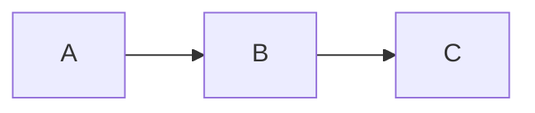

# Example Markdown File

## Sphinx Placeholder
- just making this as a placeholder to test basic documentation building

## Mermaid Example
- Sphinx can build Mermaid diagrams thanks to `sphinxcontrib.mermaid` and `myst-parser` (included with `myst-nb`)
- if `myst_fence_as_directive = ["mermaid"]` is set in `conf.py`, Sphinx will render diagrams created with triple backtick mermaid code blocks (otherwise you'll get the error `Pygments lexer name 'mermaid is not known` while building docs)
- I had to add [custom.css](../_static/custom.css) with `!important` flags to get the arrows to show up against the background in Sphinx Book Theme's Dark Mode, as mermaid themes and regular css styles were being overridden by really high-specificity css (something must be set really late in the process, maybe even live when pressing the Dark Mode button)

