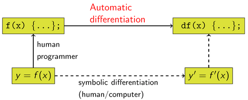
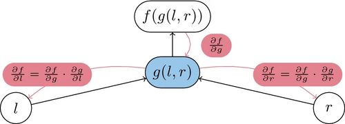

# Learning Pytorch
 
## Pytorch.org tutorials - Learning Pytorch with Examples
- Henry Diaz linked to this along with some other bits and discussions in #ai-factory on Slack
    - I really wish I'd gone through this earlier (also wish I'd known to go through it earlier)
    - Modulus abstracts enough that it lets you get spinning without really understanding Pytorch or its Tensors
    - that was enough, until now at least. I'll build a simple model to test my gradient-in-the-loss theory
- Main page
    - https://pytorch.org/tutorials/beginner/pytorch_with_examples.html
- Autograd link
    - https://pytorch.org/tutorials/beginner/pytorch_with_examples.html#pytorch-tensors-and-autograd
- Newer Code
    - apparently their newer tutorial code is here, though I kind of prefer the all-in-one-page style
    - https://pytorch.org/tutorials/beginner/basics/intro.html
 
## Basics
- Pytorch provides two core features
    - an n-dimensional Tensor, similar to numpy, but can be run on GPU's
    - auotmatic differentiation for building and training neural networks
 
## Without Pytorch: Numpy Network
- inputs are an array of 2000 training points
    - $x = -{\pi\over2},-{\pi\over2}+{\pi\over2000},-{\pi\over2}+{2\pi\over2000},\cdots,{\pi\over2}$
- actual function we're trying to fit (y becomes array of 2000 true points) (calculate once)
    - $y=sin(x)$
- each round they do this, calculating an estimate and loss, gradients, updating the weights
    - try to fit with a polynomial with randomly initialized weights $a,b,c,d$ ($y_{pred}$ becomes an array of 2000 predicted points)
        - $y_{pred}=a+b*x+c*x^2+d*x^3$
    - calculate the Loss of each step by summing the error up from each of the 2000 $y_{pred}$ points each step (Loss)
        - $L_{point}=(y_{pred}-y)^2$
        - $L_{step}=\sum\limits_{i=1}^{2000}(y_{pred}-y)^2$
    - will use the chain rule to calculate gradient of the Loss with respect to each weight
        - $\displaystyle{\begin{aligned} {\partial L_{step}\over\partial a} &=\sum{\partial L_{point}\over\partial a} \\ {\partial L_{point}\over\partial a}  &= {\partial L_{point}\over\partial y_{pred}} {\partial y_{pred}\over\partial a} \\ {\partial L_{point}\over\partial y_{pred}} &=2(y_{pred}-y) \\ \end{aligned}}$
    - calculate gradient of Loss with respect to each weight
        - $\displaystyle\begin{aligned} {\partial y_{pred}\over\partial a} & =1   &\to {\partial L_{point}\over\partial a} & =2(y_{pred}-y) 1   &\to {\partial L_{step}\over\partial a} & =\sum 2(y_{pred}-y) 1   \\ {\partial y_{pred}\over\partial b} & =x   &\to {\partial L_{point}\over\partial b} & =2(y_{pred}-y) x   &\to {\partial L_{step}\over\partial b} & =\sum 2(y_{pred}-y) x   \\ {\partial y_{pred}\over\partial c} & =x^2 &\to {\partial L_{point}\over\partial c} & =2(y_{pred}-y) x^2 &\to {\partial L_{step}\over\partial c} & =\sum 2(y_{pred}-y) x^2 \\ {\partial y_{pred}\over\partial d} & =x^3 &\to {\partial L_{point}\over\partial d} & =2(y_{pred}-y) x^3 &\to {\partial L_{step}\over\partial d} & =\sum 2(y_{pred}-y) x^3 \\ \end{aligned}$
    - calculate each of these for 2000 points for 2000 steps, updating the model weights each step
        - calculate gradient with respect to each weight
        - update the weights
        - it got the error down decently well
 
### Negative Gradients
- note that whenever a gradient is applied it looks like
    - `a -= learning_rate * grad_a`
- this is because we are trying to *minimize* loss
- and the gradient is the direction to go to most swiftly *increase* the loss
- since gradient is the direction of *greatest increase*
- so in order to minimize, we move *opposite the direction of greatest increase*
- i.e. negative gradient, the exact opposite of the gradient direction
 
```python
# -*- coding: utf-8 -*-
import numpy as np
import math
 
# Create random input and output data
x = np.linspace(-math.pi, math.pi, 2000)
y = np.sin(x)
 
# Randomly initialize weights
a = np.random.randn()
b = np.random.randn()
c = np.random.randn()
d = np.random.randn()
 
# multiply by the gradient to determine how much to update them each round
learning_rate = 1e-6
 
# train for 2000 rounds. 't'
for t in range(2000):
    # Forward pass: compute predicted y
    # y = a + b x + c x^2 + d x^3
    y_pred = a + b * x + c * x ** 2 + d * x ** 3
 
    # Compute loss by squaring the difference between the prediction and the true value
    # didn't divide it by the number of points either
    loss = np.square(y_pred - y).sum()
 
    #print the loss at 99 steps and every 100 after that
    if t % 100 == 99:
        print("step:", t,"loss:", loss)
 
    # Backprop to compute gradients of a, b, c, d with respect to loss
 
    # multiply the error between prediction and true by 2. Will be an array of 2000 errors
    grad_y_pred = 2.0 * (y_pred - y)
    # calculate the gradients of the loss with respect to each weight and sum up into one value
    grad_a = grad_y_pred.sum()
    grad_b = (grad_y_pred * x).sum()
    grad_c = (grad_y_pred * x ** 2).sum()
    grad_d = (grad_y_pred * x ** 3).sum()
 
    # Update weights, subtracting the gradient multiplied by the learning rate
    a -= learning_rate * grad_a # NOTE - gradient is the direction of greatest increase to a function
    b -= learning_rate * grad_b # we want to decrease the function (loss)
    c -= learning_rate * grad_c # so we subtract our gradients
    d -= learning_rate * grad_d
 
print(f'Result: y = {a} + {b} x + {c} x^2 + {d} x^3')
```
 
## Adding Pytorch: Tensors
- Numpy is cool, but can't use GPU to accelerate calculations (which would be like 50X faster or more)
    - Use Pytorch Tensors - it's like a numpy array but it can keep track of the computational graph and gradients
    - can also use GPU's - you just need to specify the device
- do basically the same thing as before
    - but use stuff like `torch.linspace` instead of `np.linspace`
    - and assign them to the device to solve on
- PyTorch must be keeping a record of what Tensors are on what device, how they're calculated, etc
    - it will let the GPU do the calculations without having to send instructions to it every step
    - the record of what's where and how's calculated is the the computational graph?
- must define the forward and backward steps here as well
 
```python
# -*- coding: utf-8 -*-
 
import torch
import math
 
dtype = torch.float # set the datatype for the new Tensors to store to be torch floats
device = torch.device("cpu") # set to use the cpu
# device = torch.device("cuda:0") # Uncomment this to run on GPU
 
# Create random input and output data
x = torch.linspace(-math.pi, math.pi, 2000, device=device, dtype=dtype) # <- create the 2000
y = torch.sin(x) # <- define the 2000 true points in the established range
 
# Randomly initialize weights and put the tensor on the device
a = torch.randn((), device=device, dtype=dtype)
b = torch.randn((), device=device, dtype=dtype)
c = torch.randn((), device=device, dtype=dtype)
d = torch.randn((), device=device, dtype=dtype)
 
learning_rate = 1e-6
for t in range(2000):
   
    ################
    # Forward pass # compute prediction
    ################ compute loss
 
    # compute predicted y
    y_pred = a + b * x + c * x ** 2 + d * x ** 3
 
    # Compute and print loss
    loss = (y_pred - y).pow(2).sum().item()
    if t % 100 == 99:
        print(t, loss)
 
    ##################
    # Backwards Pass # calculate gradients
    ################## update weights
 
    # Backprop to compute gradients of a, b, c, d with respect to loss
    grad_y_pred = 2.0 * (y_pred - y)
    grad_a = grad_y_pred.sum()
    grad_b = (grad_y_pred * x).sum()
    grad_c = (grad_y_pred * x ** 2).sum()
    grad_d = (grad_y_pred * x ** 3).sum()
 
    # Update weights using gradient descent
    a -= learning_rate * grad_a
    b -= learning_rate * grad_b
    c -= learning_rate * grad_c
    d -= learning_rate * grad_d
 
print(f'Result: y = {a.item()} + {b.item()} x + {c.item()} x^2 + {d.item()} x^3')
print(f'Final Loss: {loss}')
```
 
## Autograd
- now we get into the real special capabilities of Torch
    - we had to define forward and backward passes manually up above
    - that's ok for such a tiny 'network' of four weights, but would scale up drastically
    - luckily, Torch is capable of automatic differentiation, bypassing the symbolic by-hand differentiation that I, a human, needed to do
- AUTOMATIC DIFFERENTIATION [(Wiki Link)](https://en.wikipedia.org/wiki/Automatic_differentiation)
    - 
    - uses the chain rule, taking derivative of each little operation ("accumulating" derivatives)
        - say we have a function of other functions
            - $y=f(g(h(x)))$
        - to evaluate it, we would
            - feed in some $x$-value (call it $w_0$),
            - evaluate the innermost function to get $w_1=h(w_{0})$,
            - then evaluate the next innermost function and so on until we got to the outside
                - ${\displaystyle {\begin{aligned} y&=f(g(h(x))) & \gets && x & =w_{0}\\ &=f(g(h(w_{0})))& \gets && h(w_{0}) & =w_{1}\\ &=f(g(w_{1})) & \gets && g(w_{1}) & =w_{2}\\ &=f(w_{2}) & \gets && f(w_{2}) & =w_{3}\\ &=w_{3} \end{aligned}}}$
            - so now we've got four values, one for each of the component functions in the chain
                - ${\displaystyle {\begin{aligned} y= && w_{3} & =f(w_{2}) \\ && w_{2} & =g(w_{1}) \\ && w_{1} & =h(w_{0}) \\ && w_{0} & =x \end{aligned}}}$
        - if we wanted the gradient of $y$ with respect to $x$, we would use the chain rule
            - ${\displaystyle {\frac {\partial y}{\partial x}}={\frac {\partial f(w_{2})}{\partial w_{2}}}{\frac {\partial g(w_{1})}{\partial w_{1}}}{\frac {\partial h(w_{0})}{\partial x}}={\frac {\partial y}{\partial w_{2}}}{\frac {\partial w_{2}}{\partial w_{1}}}{\frac {\partial w_{1}}{\partial x}}}$
    - can be done forwards or backwards. backpropogation is a special case of reverse accumulation
        - forwards (tangent mode) traverses the chain rule from the inside out starting with $\displaystyle{\frac {\partial w_{1}}{\partial x}}$
            - $\to$ more efficient if more outputs than inputs?
            - hold the output constant and differentiate backwards with
        - backwards (adjoint mode) traverses the chain rule from the outside in starting with $\displaystyle{\frac {\partial f(w_{2})}{\partial w_{2}}}$
            - $\to$ more efficient if more inputs than outputs?
    - backwards is more efficient for the setup we have with machine learning (often network has a single output and many inputs)
        - great for a neural network that converges down into few outputs since you start with output, find the derivative, and branch it backwards
        - basically you get to calculate a partial derivative once and reuse it a bunch of times, which is great if there are fewer outputs than inputs
        - 
        - for forward propogation the inputs are you basically need to evaluate the gradients once for each independent variable (input)
        - for forward propogation you basically need to evaluate the gradients once for each independent variable (input)
    - Reverse Accumulation by hand - you substitute the derivative of the outermost function with a new chain rule repeatedly
        - ${\displaystyle {\begin{aligned}{\frac {\partial y}{\partial x}}&={\frac {\partial y}{\partial w_{1}}}{\frac {\partial w_{1}}{\partial x}}\\&=\left({\frac {\partial y}{\partial w_{2}}}{\frac {\partial w_{2}}{\partial w_{1}}}\right){\frac {\partial w_{1}}{\partial x}}\\&=\left(\left({\frac {\partial y}{\partial w_{3}}}{\frac {\partial w_{3}}{\partial w_{2}}}\right){\frac {\partial w_{2}}{\partial w_{1}}}\right){\frac {\partial w_{1}}{\partial x}}\\&=\cdots \end{aligned}}}$
    - Reverse accumulation by The **adjoint** ${\bar {w}}_{i}$ - the derivative of a chosen dependent variable with respect to a *subexpression* $w_{i}$
        - ${\displaystyle {\bar {w}}_{i}={\frac {\partial y}{\partial w_{i}}}}$
    - If $w_i$ has successors in the computational graph, use the chain rule:
        - ${\displaystyle {\bar {w}}_{i}=\sum _{j\in \{{\text{successors of i}}\}}{\bar {w}}_{j}{\frac {\partial w_{j}}{\partial w_{i}}}}$
        - I believe that this is what's accounting for nodes ahead of the current one being affected by its changes
        - you have to sum up the effect it has on all of the nodes it feeds into
        - and the activation of a node feeds into all the nodes ahead of it in a fully-connected network
        - and then since all of those nodes feed into all of the nodes ahead of them...
        - well, you do already have all of those partial derivatives from doing the layers in front of the current one
        - but that's a lot of numbers getting multiplied together
    - note that there is additional overhead for reverse propogation
        - you need to store those partial derivative values

## PyTorch: Tensors and Autograd
- provides the funcionality from above
- **Forward Pass** of the network
    - defines the **computational graph**
        - nodes in the graph will be Tensors
            - if `x` is a Tensor that has the setting `x.requires_grad=True`
            - then `x.grad` will be another Tensor that will hold the gradient of `x` with respect to some scalar value
        - edges will be functions that produce output Tensors from input Tensors
            - are edges weights and biases?
            - or is an edge like $a=\sigma(w\cdot a+b)$?
- **Backwards Propogation**
    - backpropogate through the graph
        - computes gradients
- previously we had to manually create the gradients for the backwards pass with
    - `grad_y_pred = 2.0 * (y_pred - y)` and `grad_a = grad_y_pred.sum()` etc
- this time, we'll just use `loss.backward()`
    - no need to manually implement the gradients this time
- since `loss` was established as a function of $y_{pred}$ which is a function of the weights `a,b,c,d`
    - and because Pytorch will keep track of how it got to its final function?
    - since it creates a computational graph to get there and keeps it on hand?
    - the computational graph being composed of node `Tensors` and function `Edges`?
    - so it's easy to work backwards and find the gradients?
 
```python
# -*- coding: utf-8 -*-
import torch
import math
 
dtype = torch.float # <- assign the type of data to store in the Tensors
#device = "cuda" if torch.cuda.is_available() else "cpu" # <- use a CUDA gpu if it's available
#torch.set_default_device(device) # <- can set the default device instead of setting it every time we initiate a Tensor
# NOTE that didn't work for my version of torch, I guess set_default_device is an older way.
# looks like I can still run torch without specifying device though
 
# Create Tensors to hold input and outputs.
# By default, requires_grad=False, which indicates that we do not need to
# compute gradients with respect to these Tensors during the backward pass.
x = torch.linspace(-math.pi, math.pi, 2000, dtype=dtype)
y = torch.sin(x)
 
# Create random Tensors for weights. For a third order polynomial, we need
# 4 weights: y = a + b x + c x^2 + d x^3
# Setting requires_grad=True indicates that we want to compute gradients with
# respect to these Tensors during the backward pass.
a = torch.randn((), dtype=dtype, requires_grad=True)
b = torch.randn((), dtype=dtype, requires_grad=True)
c = torch.randn((), dtype=dtype, requires_grad=True)
d = torch.randn((), dtype=dtype, requires_grad=True)
 
learning_rate = 1e-6
for t in range(2000):
 
    ################ compute prediction and loss - this is the forward pass
    # Forward Pass # that will tell Torch what the structure of the network is
    ################ the 'loss' tensor basically IS the network at that point
   
    # Forward pass: compute predicted y using operations on Tensors.
    y_pred = a + b * x + c * x ** 2 + d * x ** 3
 
    # Compute and print loss using operations on Tensors.
    # Now loss is a Tensor of shape (1,)
    # loss.item() gets the scalar value held in the loss.
    loss = (y_pred - y).pow(2).sum()
    if t % 100 == 99:
        pass
        #print("Step:", t, "Loss:", loss.item())
 
    ################## compute the gradients of each of the weights of the network
    # Backwards Pass # loss.backward() will use knowledge of the network set up by the forward pass
    ################## and go backwards through it, determining gradients of each weight (but not changing them)
 
    # Use autograd to compute the backward pass. This call will compute the
    # gradient of loss with respect to all Tensors with requires_grad=True.
    # After this call a.grad, b.grad. c.grad and d.grad will be Tensors holding
    # the gradient of the loss with respect to a, b, c, d respectively.
    loss.backward()
 
    ####################
    # Update Gradients #
    ####################
 
    # Manually update weights using gradient descent. Wrap in torch.no_grad()
    # because weights have requires_grad=True, but we don't need to track this
    # in autograd.
    with torch.no_grad():
        a -= learning_rate * a.grad
        b -= learning_rate * b.grad
        c -= learning_rate * c.grad
        d -= learning_rate * d.grad
 
        if t % 100 == 99:
            # print the gradients!
            # NOTE - gradients are Tensors. I don't think I could do this f-string stuff if the Tensors were bigger than 1x1
            print(f'Step: {t} Loss: {loss.item()} a.grad: {a.grad} b.grad: {b.grad} c.grad: {c.grad} d.grad: {d.grad}')
 
        # Manually zero the gradients after updating weights
        a.grad = None
        b.grad = None
        c.grad = None
        d.grad = None
 
print(f'Result: y = {a.item()} + {b.item()} x + {c.item()} x^2 + {d.item()} x^3')
print(f'Final Loss: {loss}')
```
 
## latex formulas in docstrings
-  the docstring in  https://github.com/pytorch/pytorch/blob/main/torch/nn/utils/parametrizations.py
- for def weight_norm includes this:
- $\mathbf{w} = g \dfrac{\mathbf{v}}{\|\mathbf{v}\|}$
- which turns into this formula
- $\mathbf{w} = g \dfrac{\mathbf{v}}{\|\mathbf{v}\|}$
- so it must be possible to put latex formulas in docstrings
 
## Defining new Autograd functions
- each Autograd operator is basically just two functions that operate on Tensors
    - `forward`
        - computes output Tensors from input Tensors
        - necessary as the activations of each node and such are plugged in to the chain rule functions
    - `backward`
        - receives the gradient of the output Tensors with respect to some scalar value (from the custom autograd?)
        - computes the gradient of the input Tensors with respect to that same scalar value (using the custom autograd?)
- can define our own autograd function by:
    - define a subclass of `torch.autograd.Function`
    - implement `forward` and `backward` functions
- then use it by:
    - construct instance of the new autograd operator
    - and call it like a function, passing in input Tensors
- example:
    - define new model using a [Legendre Polynomial](https://en.wikipedia.org/wiki/Legendre_polynomials) instead of $y_{pred}=a+b*x+c*x^2+d*x^3$
        - 3rd-degree Legendre Polynomial (the red one) looks like a sine wave
        - 
        - By <a href="//commons.wikimedia.org/wiki/User:Geek3" title="User:Geek3">Geek3</a> - <span class="int-own-work" lang="en">Own work</span>, <a href="https://creativecommons.org/licenses/by-sa/3.0" title="Creative Commons Attribution-Share Alike 3.0">CC BY-SA 3.0</a>, <a href="https://commons.wikimedia.org/w/index.php?curid=9552813">Link</a>
    - model is
        - $y_{pred}=a+bP_3(c+dx)$
        - $P_3(t)={1\over2}(5t^3-3t) \gets$ 3rd-degree Legendre Polynomial
        - $y_{pred}=a+{1\over2}b(5(c+dx)^3-3(c+dx))$
    - write a custom autograd function for computing forward and backward of $P_3(x)$
        - use it to implement the model
 
```python
# -*- coding: utf-8 -*-
import torch
import math
 
# create a new class of torch.autograd.Function by passing that function to the new class
# the class will have everything that torch.autograd.Function usually has
# but we will overwrite some specific functions to be what we want
# specifically, we are only overwriting the forward and backwards ones
class LegendrePolynomial3(torch.autograd.Function):
    """
    We can implement our own custom autograd Functions by subclassing
    torch.autograd.Function and implementing the forward and backward passes
    which operate on Tensors.
    """
 
    @staticmethod
    def forward(ctx, input):
        """
        In the forward pass we receive a Tensor containing the input and return
        a Tensor containing the output. ctx is a context object that can be used
        to stash information for backward computation. You can cache arbitrary
        objects for use in the backward pass using the ctx.save_for_backward method.
        """
        # save the input that we're about to feed in for later
        # both forward and backwards receive ctx, though it's not a self variable
        # Torch must know to pass it to and from when it calls these two functions
        # this `ctx` probably only available for this 'network' that calculates the P3 portion
        ctx.save_for_backward(input)
        # Compute the value of P_3 from the input ( which will be (c+dx) )
        # this 'network' only computes the 'P_3' chunk of the graph
        # so all we need to do is establish how you calculate 'P_3(t)' from 't' here
        # P_3(t)=(1/2)(5t^3-3t)
        return 0.5 * (5 * input ** 3 - 3 * input) # create the output from the input
 
    @staticmethod
    def backward(ctx, grad_output):
        """
        In the backward pass we receive a Tensor containing the gradient of the loss
        with respect to the output, and we need to compute the gradient of the loss
        with respect to the input.
        """
        # backward receives grad_output Tensor
        #   it contains the gradient of the Loss with respect to the output of this network
        #   this 'network' consists only of the 'P_3(t)' portion
        # in essence, that means it will contain all the chain rule stuff from after this network
        #   the a and b part of y_pred = a + b * P3(c + d * x)
        #   the part from loss = (y_pred - y).pow(2).sum()
        # but it won't be able to go past this P3 thing to get the gradient with respect to c and d
        #   since those are the inputs to this 'network'
        #   we need to give it the chain rule chunk for the P3 portion of the network
        #   so it can calculate the derivatives with respect to weights behind this network
        # so our custom autograd is telling our 'network' that calculates P3
        #   how to calculate P3(t) on the forward pass
        #   how to do the chunk of chain rule between output ( P_3(t) ) and input ( t )
        #   that way when we're trying to get the gradients for c and d,
        #   it can use the 'chain rule chunk' from this P3 portion to get to them
        # calculate the gradient of this networks output ( P_3(t) ) and input ( t )
        #         P_3(t)=(1/2)(5t^3-3t)
        #               =(5/2)t^3-(3/2)t
        #   {d/dt}P_3(t)=(15/2)t^2-(3/2)
        #               =(3/2)(5t^2-1)
        #               =(3/2)(5t^2-1)
        #     {dLoss/dt}={dLoss/dP_3(t)}{dP_3(t)/dt}
        #               ={dLoss/dP_3(t)}(3/2)(5t^2-1)
        #               =grad_output *  (3/2)(5t^2-1)
 
        # retrieve the input (x) from the ctx saved Tensor
        input, = ctx.saved_tensors
        # take grad_output, the gradient of everything that happened after this networks output
        # apply the gradient of everything that happens in this network to it
        # return that so that whatever's behind this in the network
        # will have the gradient of the Loss with respect to its output
        return grad_output * 1.5 * (5 * input ** 2 - 1)
 
 
# select the datatype for the Tensors and what device we want to run calculations on
dtype = torch.float
device = torch.device("cpu")
# device = torch.device("cuda:0")  # Uncomment this to run on GPU
 
# Create Tensors to hold input and outputs.
# By default, requires_grad=False, which indicates that we do not need to
# compute gradients with respect to these Tensors during the backward pass.
# we allow these to use requires_grad=False since we will not be adjusting these
# and therefore don't need their gradients
x = torch.linspace(-math.pi, math.pi, 2000, device=device, dtype=dtype)
y = torch.sin(x)
 
# Create random Tensors for weights. For this example, we need
# 4 weights: y = a + b * P3(c + d * x), these weights need to be initialized
# not too far from the correct result to ensure convergence.
# Setting requires_grad=True indicates that we want to compute gradients with
# respect to these Tensors during the backward pass.
# we set requires_grad=True for the since we will need gradients to adjust them
# previously we initialized them with random numbers using torch.randn
# but polynomials tend to explode with this stuff instead of converging,
# so they need to be initialized closer to final values and we fill them with 0,-1,0,0.3
a = torch.full((),  0.0, device=device, dtype=dtype, requires_grad=True)
b = torch.full((), -1.0, device=device, dtype=dtype, requires_grad=True)
c = torch.full((),  0.0, device=device, dtype=dtype, requires_grad=True)
d = torch.full((),  0.3, device=device, dtype=dtype, requires_grad=True)
 
# wow. That's a tiny learning rate.
learning_rate = 5e-6
for t in range(2000):
    # To apply our Function, we use Function.apply method. We alias this as 'P3'.
    # oh hey look it's the name of our Class from a minute ago
    # .apply must tell it to call forward from the class when its called
    # it probably
    P3 = LegendrePolynomial3.apply
 
    # Forward pass: compute predicted y using operations;
    # we compute P3 using our custom autograd operation
    # this will also save it to the graph so Torch knows how to do the backwards pass
    y_pred = a + b * P3(c + d * x)
 
    # Compute and print loss
    loss = (y_pred - y).pow(2).sum()
    if t % 100 == 99:
        print("Step:", t, "Loss:", loss.item())
 
    # Use autograd to compute the backward pass.
    # It will have saved the path through the other Tensors to get to the Loss
    # so now it will retrace its steps to get the gradient of each chunk in the process
    loss.backward()
 
    # Update weights using gradient descent
    with torch.no_grad():
        a -= learning_rate * a.grad
        b -= learning_rate * b.grad
        c -= learning_rate * c.grad
        d -= learning_rate * d.grad
 
        # Manually zero the gradients after updating weights
        a.grad = None
        b.grad = None
        c.grad = None
        d.grad = None
 
print(f'Result: y = {a.item()} + {b.item()} * P3({c.item()} + {d.item()} x)')
```
 
## Pytorch's `nn` module
- For big neural networks, raw autograd can be a bit too low-level
    - we are usually building the computation into **layers**, some of which have **learnable parameters** to optimize
- Pytorch uses the `nn` module to provide high level abstractions over raw computational graphs
    - this is the equivalent `TensorFlow` packages like of `Keras`, `TensorFlow-Slim`, and `TFLearn`
- The `nn` package
    - defines a set of **modules**
        - roughly equivalent to neural network layers
        - receives input Tensors, computes output Tensors
        - may also hold internal state such as Tensors containing learnable parameters
        - defines a set of useful loss functions
- example
    - using the `nn` package to implement our polynomial model network
 
### Zeroing Gradients
- we always seem to need to zero the gradients after we apply them
- that was true for both the manual method and this `nn` method
- I wonder if it just sums them up otherwise
 
```python
# -*- coding: utf-8 -*-
import torch
import math
 
# Create Tensors to hold input and outputs. Both will be 2000-element 1D Tensors
x = torch.linspace(-math.pi, math.pi, 2000)
print("x tensor of inputs x, shape:", x.shape, "contents:\n",x)
y = torch.sin(x)
print("y tensor of true outputs y, shape:", y.shape, "contents:\n",y)
 
# For this example, the output y is a linear function of (x, x^2, x^3), so
# we can consider it as a linear layer neural network. Let's prepare the
# tensor of (x, x^2, x^3) values
p = torch.tensor([1, 2, 3])
print("p tensor of powers (x,x^2,x^3), shape:", p.shape, "contents:\n",p)
# unsqeeze(-1) adds a new dimension after the last index, so it adds 1 after (2000) to get (2000,1)
# use x.unsqueeze(-1) to convert the x tensor of shape (2000) with 2000 linearly-spaced x-values
# Raise it to the power of the p-tensor [1, 2, 3] of shape (3,1)
# this will broadcast the shape of x.unsqueeze(-1) from (2000,1) to (2000,3)
# (basically copying the column over three times)
# then raise each element to the appropriate power from the same column of p
xx = x.unsqueeze(-1).pow(p)
print("xx tensor of x,x^2,x^3-values, shape:", xx.shape, "contents:\n",xx)
# In the above code, x.unsqueeze(-1) has shape (2000, 1), and p has shape
# (3,), for this case, broadcasting semantics will apply to obtain a tensor
# of shape (2000, 3)
 
# Use the nn package to define our model as a sequence of layers. nn.Sequential
# is a Module which contains other Modules, and applies them in sequence to
# produce its output. The Linear Module computes output from input using a
# linear function, and holds internal Tensors for its weight and bias.
# The Flatten layer flattens the output of the linear layer to a 1D tensor,
# to match the shape of `y`
model = torch.nn.Sequential( # create Sequential nn Module containing other nn Modules
    # add a Linear nn Module
    # This will take the input Tensor (we will give it the (2000,3) Tensor with columns of [x, x^2, x^3] values)
    # and produce an output Tensor of (2000,1) y_pred=a1 x + a2 x^2 + a3 x^3 + b values
    # Linear will automatically incorporate the weights and biases (it defaults to bias=True)
    # Linear will apply a linear transformation of y = xA^T + b to the incoming data
    # A^T is the (3,1) transpose of the (1,3) weights Tensor containing the weights for x^1, x^2, x^3
    # b is the bias Tensor, it only contains 1 element
    # so xA^T -> (2000,3)(3,1) -> (2000,1) <- it is multiplying a1 by each x entry, a2 by each x^2 entry, etc and then adding the columns up
    #    xA^T + b -> (2000,1) + (1) = (2000,1) <- adding a scalar to a Tensor should just add it element by element
    # so its outputting a (2000,1) Tensor of y_pred values, one y_pred per each of the 2000 input x samples
    # in_features = 3, out_features=1, meaning it will take 3 inputs (x,x^2,x^3) and deliver 1 output (y_pred)
    torch.nn.Linear(3, 1), # nn Module to perform linear transformation
    # but wait, y and y_pred will be 1D tensors of size (2000), not (2000,1)
    # so flatten this result into a 1D tensor of size (2000)
    torch.nn.Flatten(0, 1) # nn Module to flatten the output into a 1D Tensor to look like y and y_pred
)
 
# The nn package also contains definitions of popular loss functions; in this
# case we will use Mean Squared Error (MSE) as our loss function.
# this will do the 'loss = (y_pred - y).pow(2).sum()' bit
loss_fn = torch.nn.MSELoss(reduction='sum')
 
learning_rate = 1e-6
for t in range(2000):
 
    # Forward pass: compute predicted y by passing x to the model.
    # Module objects override the __call__ operator so you can call them like functions.
    # When doing so you pass a Tensor of input data to the Module
    # and it produces a Tensor of output data, y_pred, which is 2000 elements long
    # interestingly, it seems to be back to being shape (2000) all in one row instead of one column
    y_pred = model(xx)
 
    # Compute and print loss. We pass Tensors containing the predicted and true
    # values of y, and the loss function returns a Tensor containing the loss.
    loss = loss_fn(y_pred, y)
    # print the loss at step 99 and every 100 after that
    if t % 1000 == 99:
        print("Step:", t, "Loss:", loss.item())
 
    # Zero the gradients before running the backward pass.
    # Would it just add new grads onto it otherwise?
    # I guess that would fit with chain rule
    model.zero_grad()
 
    # Backward pass: compute gradient of the loss with respect to all the learnable
    # parameters of the model. Internally, the parameters of each Module are stored
    # in Tensors with requires_grad=True, so this call will compute gradients for
    # all learnable parameters in the model.
    loss.backward()
 
    # Update the weights using gradient descent. Each parameter is a Tensor, so
    # we can access its gradients like we did before.
    # NOTE - we always use no_grad for these
    # is that so we don't store the gradients when we do this?
    with torch.no_grad():
        for param in model.parameters():
            param -= learning_rate * param.grad
 
# You can access the first layer of `model` like accessing the first item of a list
linear_layer = model[0]
 
# For linear layer, its parameters are stored as `weight` and `bias`.
print(f'Result: y = {linear_layer.bias.item()} + {linear_layer.weight[:, 0].item()} x + {linear_layer.weight[:, 1].item()} x^2 + {linear_layer.weight[:, 2].item()} x^3')
print(f'Final Loss: {loss}')
print("y_pred tensor, shape:", y_pred.shape, "contents:\n",y_pred)
# try and print out the gradients
print('printing named parameter data')
with torch.no_grad():
    for name, param in model.named_parameters():
        if param.requires_grad:
            print("param name:", name, "data:", param.data, "grad", param.grad)
```
 
## PyTorch's Optim Package
- we've been manually updating the weights so far. Each time, we've:
    - run through the entire training data set,
    - found the Loss for the entire training data set by summing up the squared error from each x-point
    - done backprop to get the gradient of the Loss with respect to each of the learnable parameters
    - applied `torch.no_grad()` to manually manipulate the learnable parameters by
    - multiplying the current value of the learnable parameters by that gradient and the learning rate
    - looped back around and did it all again 2000 times
- Optimizers
    - that was ok for a simple optimization like stochastic gradient descent
    - but in practice we'll want to use more sophisticated optimizers like `AdaGrad`, `RMSProp`, or `Adam`
    - the `optim` package can perform those
- Compactness
    - wow, this code is getting way more compact
    - if I removed all of the comments it would be downright slim
 
### optimizer.zero_grad() and WHY WE ZERO GRADIENTS
- FINALLY they explain why we always zero out the gradients
    - by default, gradients are not overwritten, they are saved to buffers
    - so if I *didn't* zero them out, we would be accumulating more and more stored gradients every training step
    - and those bois can get *big*
    - and since I'm using Jupyter, I'll bet I would have just accumulated more and more every time I hit run until the kernel crashed
- summing up gradients
    - in the 3blue1brown video,
    - it was mentioned that you do your backpropogation to get a list of gradients for each training input in a batch
    - then you sum those up
    - so the purpose of it defaulting to keeping them around is probably so that you can sum up the gradients for a batch
    - and use that to get your final gradient values that actually get applied to update your weights
    - and it doesn't just sum them up as it goes since you may want to do something more complicated
    - I mean Neural Tangent Kernel and other methods would probably want to hold back some specific gradients etc
    - so it saves the gradient 'suggestions' for each training case, combines them for the batch (somehow)
    - and then you call `optimizer.step()`, which has procedures or optimization and has been given both your model and the learning rate
    - and that uses those sets of gradients to figure out how to update
 
```python
# -*- coding: utf-8 -*-
import torch
import math
 
 
# Create Tensors to hold input and outputs with dimensions (2000)
x = torch.linspace(-math.pi, math.pi, 2000)
y = torch.sin(x)
 
# Prepare the input tensor (x, x^2, x^3) as before, with dimensions (2000,3)
p = torch.tensor([1, 2, 3])
xx = x.unsqueeze(-1).pow(p)
 
# Use the nn package to define our model and loss function
model = torch.nn.Sequential( # Create a Sequential Module
    torch.nn.Linear(3, 1), # add a Linear Module to apply weights and biases, sum up and compute a y_pred (2000,1) Tensor
    torch.nn.Flatten(0, 1) # add a Flatten Module flatten the y_pred tensor from (2000,1) to (2000) to match the true y tensor
)
 
# Create a module for the Loss, summing up the MSE errors of each of the 2000 point by comparing the y_pred and y Tensors
loss_fn = torch.nn.MSELoss(reduction='sum')
 
# Use the optim package to define an Optimizer that will update the weights of
# the model for us. Here we will use RMSprop; the optim package contains many other
# optimization algorithms. The first argument to the RMSprop constructor tells the
# optimizer which Tensors it should update.
learning_rate = 1e-3
# tell it to update the parameters of the model and use the learning rate
optimizer = torch.optim.RMSprop(model.parameters(), lr=learning_rate)
 
# go through 2000 steps of model updating
for t in range(2000):
    # Forward pass: compute predicted y by passing x to the model.
    y_pred = model(xx)
 
    # Compute and print loss.
    loss = loss_fn(y_pred, y)
    if t % 100 == 99:
        print("Step:", t, "Loss:", loss.item())
 
    # Before the backward pass, use the optimizer object to zero all of the
    # gradients for the variables it will update (which are the learnable
    # weights of the model). This is because by default, gradients are
    # accumulated in buffers( i.e, not overwritten) whenever .backward()
    # is called. Checkout docs of torch.autograd.backward for more details.
    optimizer.zero_grad()
 
    # Backward pass: compute gradient of the loss with respect to model parameters
    loss.backward()
 
    # Calling the step function on an Optimizer makes an update to its parameters
    optimizer.step()
 
# get the linear layer so we can grab its learnable parameters - it's the 0th layer of the model (the 1st layer is that flattening one)
linear_layer = model[0]
print(f'Result: y = {linear_layer.bias.item()} + {linear_layer.weight[:, 0].item()} x + {linear_layer.weight[:, 1].item()} x^2 + {linear_layer.weight[:, 2].item()} x^3')
```
 
## Custom `nn` Modules
- can subclass `nn.Module` to create custom modules
- define a `forward` which receives input Tensors and produces output Tensors using other modules or autograd operations on Tensors
- example: implement that 3rd order polynomial from earlier as a custom Module subclass
- looks like we don't need to define a custom `backward` procedure this time
 
```python
# -*- coding: utf-8 -*-
import torch
import math
 
class Polynomial3(torch.nn.Module):
    def __init__(self):
        """
        In the constructor we instantiate four parameters and assign them as
        member parameters of this class. Looks like we're instantiating with
        random values
        """
        super().__init__()
        self.a = torch.nn.Parameter(torch.randn(()))
        self.b = torch.nn.Parameter(torch.randn(()))
        self.c = torch.nn.Parameter(torch.randn(()))
        self.d = torch.nn.Parameter(torch.randn(()))
 
    def forward(self, x):
        """
        In the forward function we accept a Tensor of input data and we must return
        a Tensor of output data. We can use Modules defined in the constructor as
        well as arbitrary operators on Tensors.
        """
        return self.a + self.b * x + self.c * x ** 2 + self.d * x ** 3
 
    def string(self):
        """
        Just like any class in Python, you can also define custom method on PyTorch modules
        Here we define a custom method that you can call on the class to print out the equation
        with its current weights
        """
        return f'y = {self.a.item()} + {self.b.item()} x + {self.c.item()} x^2 + {self.d.item()} x^3'
 
 
# Create Tensors to hold input and outputs.
x = torch.linspace(-math.pi, math.pi, 2000)
y = torch.sin(x)
 
# Construct our model by instantiating the class defined above
model = Polynomial3()
 
# Construct our loss function and an Optimizer. The call to model.parameters()
# in the SGD constructor will contain the learnable parameters (defined
# with torch.nn.Parameter) which are members of the model.
criterion = torch.nn.MSELoss(reduction='sum')
optimizer = torch.optim.SGD(model.parameters(), lr=1e-6)
for t in range(2000):
    # Forward pass: Compute predicted y by passing x to the model
    y_pred = model(x)
 
    # Compute and print loss
    loss = criterion(y_pred, y)
    if t % 100 == 99:
        print("Step:", t, "Loss:", loss.item())
 
    # Zero gradients, perform a backward pass, and update the weights.
    optimizer.zero_grad() # zero out gradients so we don't accumulate more and more each step
    loss.backward()       # go backwards to calculate gradients of loss with respect to learnable parameters
    optimizer.step()      # use the optimizer to step in order to apply those gradients and learning rate to update the learnable parameters
 
print(f'Result: {model.string()}')
```
 
## Control Flow and Weight Sharing
- dynamic network
    - you can change up the size and shape of the network from step to step
- we're going to make a wierd model now
    - a 3rd-order polynomial
        - $y = a + bx + cx^2 + dx^3$
    - on each foward pass, it will choose a random number from 4,5,6
        - it will use that many orders, sharing a weight for them
    - The final equation could be any of these
        - $y = a + bx + cx^2 + dx^3 + ex^4$
        - $y = a + bx + cx^2 + dx^3 + ex^4 + ex^5$
        - $y = a + bx + cx^2 + dx^3 + ex^4 + ex^5 + ex^6$
- use Python flow control to implement the loop
    - implement weight sharing by resuing the same parameters multiple times when defining the forward pass
 
 
```python
# -*- coding: utf-8 -*-
import random
import torch
import math
 
# create a class for dynamic network by
class DynamicNet(torch.nn.Module):
    def __init__(self):
        """
        In the constructor we instantiate five parameters and assign them as members.
        We'll need 'e' if the random number calls for a 4th, 5th, or 6th weight
        """
        super().__init__()
        self.a = torch.nn.Parameter(torch.randn(()))
        self.b = torch.nn.Parameter(torch.randn(()))
        self.c = torch.nn.Parameter(torch.randn(()))
        self.d = torch.nn.Parameter(torch.randn(()))
        self.e = torch.nn.Parameter(torch.randn(()))
 
    def forward(self, x):
        """
        For the forward pass of the model, we randomly choose either 4, 5, or 6
        and reuse the e parameter to compute the contribution of these orders.
 
        Since each forward pass builds a dynamic computation graph, we can use normal
        Python control-flow operators like loops or conditional statements when
        defining the forward pass of the model.
 
        Here we also see that it is perfectly safe to reuse the same parameter many
        times when defining a computational graph.
        """
        # create base equation y = a + bx + cx^2 + dx^3
        y = self.a + self.b * x + self.c * x ** 2 + self.d * x ** 3
        # randint will return 4,5, or 6, so the resulting range will go from 4 to 4,5, or 6
        # so y could be as big as y = a + bx + cx^2 + dx^3 + ex^4 + ex^5 + ex^6
        for exp in range(4, random.randint(4, 6)):
            y = y + self.e * x ** exp
        return y
 
    def string(self):
        """
        Just like any class in Python, you can also define custom method on PyTorch modules
        we'll add question marks for the items that may or may not be in the model right now
        """
        return f'y = {self.a.item()} + {self.b.item()} x + {self.c.item()} x^2 + {self.d.item()} x^3 + {self.e.item()} x^4 ? + {self.e.item()} x^5 + {self.e.item()} x^6 ?'
 
 
# Create Tensors to hold input and outputs.
x = torch.linspace(-math.pi, math.pi, 2000)
y = torch.sin(x)
 
# Construct our model by instantiating the class defined above
model = DynamicNet()
 
# Construct our loss function and an Optimizer. Training this strange model with
# vanilla stochastic gradient descent is tough, so we use momentum
criterion = torch.nn.MSELoss(reduction='sum')
optimizer = torch.optim.SGD(model.parameters(), lr=1e-8, momentum=0.9)
for t in range(30000):
    # Forward pass: Compute predicted y by passing x to the model
    y_pred = model(x)
 
    # Compute and print loss
    loss = criterion(y_pred, y)
    if t % 2000 == 1999:
        print(t, loss.item())
 
    # Zero gradients, perform a backward pass, and update the weights.
    optimizer.zero_grad()
    loss.backward()
    optimizer.step()
 
print(f'Result: {model.string()}')
```
 
# PyTorch Pth Files
 
# PTH files and using a trained model
- assembled from sources such as this medium [article](https://medium.com/@yulin_li/what-exactly-is-the-pth-file-9a487044a36b)
 
## What is a PTH file
- machine learning model created with PyTorch
- contains algorithms to automatically perform a task
    - upscaling/identifying an image etc
- saved using `torch.save(model, PATH)` etc
    - `torch.save(model.state_dict(), "model.pth")`
 
## What's in it?
- a serialized PyTorch state dictionary
- Python dictionary containing the state of a PyTorch model
    - **the weights, biases, and other parameters**
- serialized means it's converted into a format to be easily saved to a disk and reconstructed
    - converted into a sequence of bytes (smaller and more compact than the original data structure)
    - the Python pickle module is what serializes it
 
## How to Use
- PTH files are not meant to be opened
- they are meant to be integrated or imported into an application
- where they can be trained further or used to perform a task
- `model = torch.load(PATH)`
- `model.load_state_dict(torch.load("model.pth"))`
    - uses `torch.load()` function to load the state dictionary from the `model.pth` file
    - uses `load_state_dict()` method to load the state dictionary into the `model` model
- I guess once you've loaded it into the `model`, you can submit a set of inputs to `model` somehow and get out a prediction