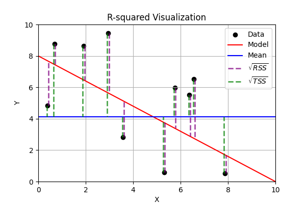

# Metrics

There are a lot of goodness of fit metrics and ways to characterize loss.

## Basics

- A model fits the data well when the differences between the **observed values** and **predicted values** are **small** and **unbiased**
- the differences between the `observed values` and `predicted values` are called `residuals`
- as the `goodness of fit` increases, the model is better fitted to the data

## Goodness of Fit metrics

- `Residuals`
  - $RSS$ = **Residual Sum of Squares** = $\sum_{i=1}^n(y_i-\hat y_i)^2$
  - $TSS$ = **Total Sum of Squares** = $\sum_{i=1}^n(y_i-\bar y_i)^2$
  - $y_i$ = observed value $i$
  - $\hat y_i$ = predicted value $i$
  - $\bar y_i$ = average of the observed values $i$
- `R-squared` (also known as **Coefficient of Determination**)
  - $\Large R^2=1-\frac{RSS}{TSS}=1-\frac{\sum_{i=1}^n(y_i-\hat y_i)^2}{\sum_{i=1}^n(y_i-\bar y_i)^2}$
    - usually `0-1` ($R^2$ can be negative is model is worse than the mean)
      - `0` = the model isn't any better at predicting than if you just used the mean
      - `1` = the model
    - always increases as more independent variables are added
    - 
- `Adjusted R-squared`
  - $\Large \bar R^2=1-\frac{RSS/DOF_{res}}{TSS/DOF_{tot}}=1-(1-R^2)\frac{n-1}{n-p-1}$
    - $DOF_{res}$ = Degrees of Freedom of population variance around mean
    - $DOF_{tot}$ = Degrees of Freedom of population variance around model
  - modification of R-squared that accounts for the number of independent variables
  - penalizes the inclusion of variables that don't actually contribute to prediction
- `MAE` = **Mean Absolute Error**
  - $\Large MAE = \frac{\sum_{i=1}^n|\hat y_i-y_i|}{n}$
- `NMAE` = **Normalized Mean Absolute Error**
- `RMSE` = **Root Mean Squared Error**
- `RMSLE` = **Root Mean Squared Logarithmic Error**
- `MAPE` = **Mean Absolute Percentage Error**
  - limitations: sensitive to values near 0, potential for asymmetric errors
- `SMAPE` = **Symmetric Mean Absolute Percentage Error**
  - improvement on `MAPE`, avoids divide by 0 errors (still hesitant to use)
