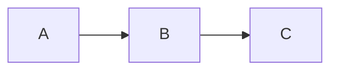

# Example Markdown File

## Sphinx Placeholder
- just making this as a placeholder to test basic documentation building

## Mermaid Example
- Sphinx can build Mermaid diagrams thanks to `sphinxcontrib.mermaid` and `myst-parser`
- triple backtick
  - renders in VSCode preview
  - renders in Sphinx if set `myst_fence_as_directive = ["mermaid"]` in `conf.py`
  - otherwise(`Pygments lexer name 'mermaid is not known`)

